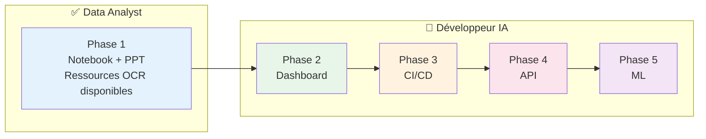
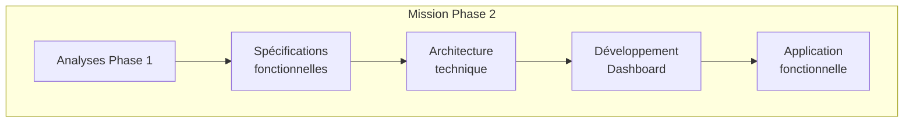
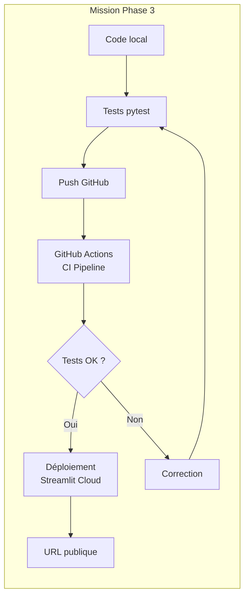
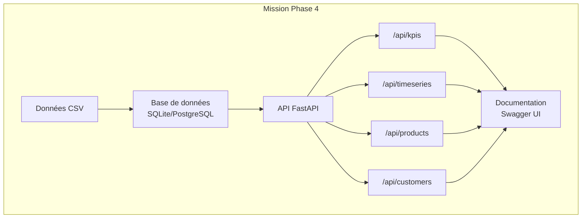
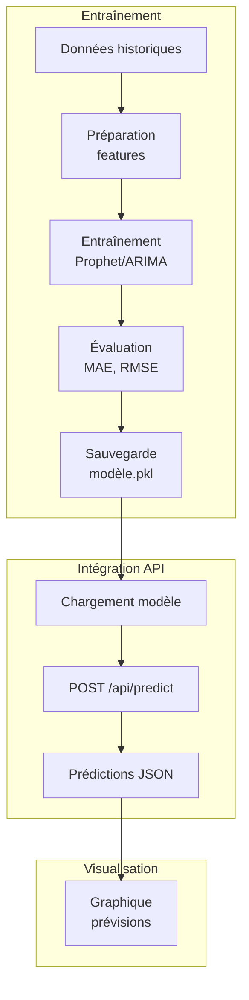
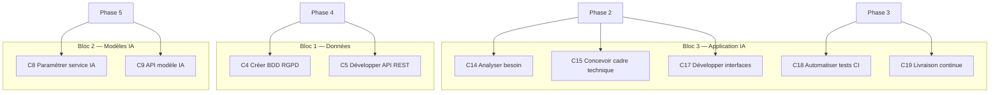

# P9 - Missions complémentaires Développeur IA
## Phases 2 à 5 — Synthèse des missions

---

## Introduction

Ce document décrit les missions complémentaires permettant d'acquérir des compétences **Développeur en Intelligence Artificielle** à partir du projet P9 Data Analyst.



| Phase | Statut | Prérequis |
|-------|--------|-----------|
| Phase 1 | Obligatoire | Ressources OCR Data Analyst |
| Phase 2 | Obligatoire | Phase 1 terminée |
| Phase 3 | Bonus | Phase 2 terminée |
| Phase 4 | Bonus | Phase 2 terminée |
| Phase 5 | Bonus | Phase 4 terminée |

---

Le périmètre des missions complémentaires est délibérément large et complexe.  
Ces travaux vous permettent d'envisager les potentielles applications liées aux données Lapage disponibles.  
Ce projet peut également servir de projet fil rouge pour la suite de la formation s'il n'est pas réalisé intégralement dans la cadre du programme OCR.

## Phase 2 — Dashboard Streamlit

### 🎯 Description de la mission

Vous allez transformer vos analyses Jupyter en une **application web interactive** permettant au CODIR de Lapage d'explorer les données de manière autonome.

Cette phase vous place dans le rôle d'un développeur qui conçoit et réalise une application à partir d'un besoin métier. Vous devrez :

1. **Analyser le besoin** : Traduire les attentes d'Annabelle et Julie en spécifications fonctionnelles
2. **Concevoir l'architecture** : Définir la structure technique de l'application
3. **Développer l'interface** : Créer un dashboard interactif avec les visualisations de la Phase 1



### 🛠️ Ressources et technologies

| Catégorie | Technologies | Usage |
|-----------|--------------|-------|
| **Framework** | Streamlit | Application web Python |
| **Visualisation** | Plotly Express, Altair | Graphiques interactifs |
| **Données** | Pandas | Manipulation des données |
| **Style** | CSS (optionnel) | Personnalisation visuelle |
| **Versioning** | Git, GitHub | Gestion du code |

**Documentation recommandée :**
- [Streamlit Documentation](https://docs.streamlit.io/)
- [Streamlit Cheat Sheet](https://docs.streamlit.io/library/cheatsheet)
- [Plotly Express](https://plotly.com/python/plotly-express/)

### 📦 Livrables attendus

| Livrable | Format | Description |
|----------|--------|-------------|
| **Spécifications** | `.md` ou autre| User stories, wireframes, critères d'acceptation |
| **Code application** | Dépôt Git | Application Streamlit multi-pages |
| **Documentation** | `README.md` | Installation, utilisation, architecture |

**Structure minimale attendue :**

```txt
lapage_project/
├── dashboard/                   # 📱 Phase 2 - Streamlit
│   ├── README.md
│   ├── app.py                   # Point d'entrée
│   ├── pages/                   # Dashboard multi-pages
│   │   ├── 1_📊_KPIs.py
│   │   ├── 2_📈_Evolution_CA.py 
│   │   └── 3_🔍_Correlations.py 
│
├── src/                         # 🔧 Code réutilisable (toutes phases)
    └── data_loader.py           # Chargement données
```

**Critères de validation :**
- [ ] Application fonctionnelle en local (`streamlit run app.py`)
- [ ] Minimum 3 pages/sections
- [ ] Graphiques interactifs (Plotly)
- [ ] Au moins un filtre fonctionnel (période, catégorie...)
- [ ] Code versionné sur Git
- [ ] README avec instructions d'installation

### 🎓 Compétences Développeur IA

| Code | Compétence | Application dans la mission |
|------|------------|----------------------------|
| **C14** | Analyser le besoin d'application d'un commanditaire | Rédiger les user stories à partir des demandes Annabelle/Julie |
| **C15** | Concevoir le cadre technique d'une application | Définir l'architecture Streamlit, choix des bibliothèques |
| **C17** | Développer les composants et interfaces d'une application | Coder le dashboard, les pages, les composants |

---

## Phase 3 — Déploiement et CI/CD

### 🎯 Description de la mission

Vous allez **industrialiser** votre dashboard en mettant en place :

1. **Des tests automatisés** : Garantir la qualité du code
2. **Une intégration continue** : Vérifier automatiquement chaque modification
3. **Un déploiement continu** : Rendre l'application accessible en ligne

Cette phase vous initie aux pratiques **DevOps** essentielles en entreprise.



### 🛠️ Ressources et technologies

| Catégorie | Technologies | Usage |
|-----------|--------------|-------|
| **Tests** | pytest | Tests unitaires et d'intégration |
| **CI/CD** | GitHub Actions | Pipeline automatisé |
| **Déploiement** | Streamlit Cloud | Hébergement gratuit |
| **Qualité code** | flake8, black | Linting et formatage |

**Documentation recommandée :**
- [pytest Documentation](https://docs.pytest.org/)
- [GitHub Actions](https://docs.github.com/en/actions)
- [Streamlit Cloud](https://docs.streamlit.io/streamlit-community-cloud)

### 📦 Livrables attendus

| Livrable | Format | Description |
|----------|--------|-------------|
| **Tests** | `tests/` | Suite de tests pytest |
| **Pipeline CI** | `.github/workflows/` | Fichier YAML GitHub Actions |
| **Application déployée** | URL | Dashboard accessible en ligne |
| **Documentation** | `README.md` | Badge CI, lien production |

**Structure minimale attendue :**
```
lapage_project/
├── .github/
│   └── workflows/
│       └── ci.yml           # Pipeline CI
├── tests/
│   ├── __init__.py
│   ├── test_data_loader.py
│   └── test_analysis.py
├── dashboard/
│   └── ...
└── README.md               # Avec badge CI + lien prod
```

**Critères de validation :**
- [ ] Minimum 5 tests pytest fonctionnels
- [ ] Pipeline GitHub Actions opérationnel
- [ ] Tests exécutés automatiquement sur push
- [ ] Application déployée sur Streamlit Cloud
- [ ] URL publique accessible
- [ ] Badge CI visible dans README

### 🎓 Compétences Développeur IA

| Code | Compétence | Application dans la mission |
|------|------------|----------------------------|
| **C18** | Automatiser les phases de tests via intégration continue | Configurer GitHub Actions, écrire les tests |
| **C19** | Créer un processus de livraison continue | Déployer automatiquement sur Streamlit Cloud |

---

## Phase 4 — API REST

### 🎯 Description de la mission

Vous allez créer une **API REST** qui expose les données et indicateurs de Lapage, permettant leur consommation par d'autres applications (dashboard, mobile, partenaires...).

Cette phase vous amène à :

1. **Structurer les données** : Créer une base de données conforme au RGPD
2. **Développer l'API** : Exposer des endpoints RESTful avec FastAPI
3. **Documenter** : Produire une documentation OpenAPI (Swagger)



### 🛠️ Ressources et technologies

| Catégorie | Technologies | Usage |
|-----------|--------------|-------|
| **Framework API** | FastAPI | API REST moderne Python |
| **Base de données** | SQLite, PostgreSQL | Stockage structuré |
| **ORM** (optionnel) | SQLAlchemy | Mapping objet-relationnel |
| **Validation** (optionnel)  | Pydantic | Schémas de données |
| **Documentation** | OpenAPI/Swagger | Doc automatique |
| **Serveur** | Uvicorn | Serveur ASGI |

**Documentation recommandée :**
- [FastAPI Documentation](https://fastapi.tiangolo.com/)
- [SQLAlchemy](https://www.sqlalchemy.org/)
- [Guide RGPD CNIL](https://www.cnil.fr/fr/rgpd-de-quoi-parle-t-on)

### 📦 Livrables attendus

| Livrable | Format | Description |
|----------|--------|-------------|
| **Schéma BDD** | `.md` ou image | MCD/MPD ou équivalent |
| **Code API** | Dépôt Git | Application FastAPI |
| **Documentation API** | Swagger UI | Accessible via `/docs` |
| **Registre RGPD** | `.md` | Registre des traitements |

**Structure minimale attendue :**
```
api/
├── app/
│   ├── __init__.py
│   ├── main.py              # Point d'entrée FastAPI
│   ├── routers/
│   │   ├── kpis.py
│   │   ├── timeseries.py
│   │   └── products.py
│   ├── models/
│   │   └── schemas.py       # Modèles Pydantic
│   └── database/
│       ├── connection.py
│       └── models.py        # Modèles SQLAlchemy
├── data/
│   └── lapage.db            # Base SQLite
├── docs/
│   ├── schema_bdd.md
│   └── rgpd_registre.md
└── README.md
```

**Endpoints minimaux attendus :**

| Endpoint | Méthode | Description |
|----------|---------|-------------|
| `GET /api/kpis` | GET | KPIs globaux (CA, nb clients...) |
| `GET /api/products` | GET | Liste des produits |

**Endpoints optionnels :**

| Endpoint | Méthode | Description |
|----------|---------|-------------|
| `GET /api/timeseries` | GET | Série temporelle CA |
| `GET /api/products/top` | GET | Top N produits |
| `GET /api/customers/segments` | GET | Segmentation clients |

**Critères de validation :**

- [ ] Base de données créée et peuplée
- [ ] Minimum 5 endpoints fonctionnels
- [ ] Documentation Swagger accessible (`/docs`)
- [ ] Authentification basique (API key)
- [ ] Schéma BDD documenté
- [ ] Registre RGPD rédigé

### 🎓 Compétences Développeur IA

| Code | Compétence | Application dans la mission |
|------|------------|----------------------------|
| **C4** | Créer une base de données dans le respect du RGPD | Modéliser et créer la BDD, documenter conformité RGPD |
| **C5** | Développer une API REST mettant à disposition les données | Développer les endpoints FastAPI |

---

## Phase 5 — Modèle prédictif

### 🎯 Description de la mission

Vous allez développer un **modèle de prévision des ventes** et l'intégrer à votre API, permettant à Lapage d'anticiper son activité.

Cette phase vous amène à :

1. **Configurer un service IA** : Entraîner et optimiser un modèle de prévision
2. **Exposer le modèle** : Créer un endpoint de prédiction via l'API
3. **Documenter** : Expliquer la méthodologie et les performances



### 🛠️ Ressources et technologies

| Catégorie | Technologies | Usage |
|-----------|--------------|-------|
| **Prévision séries temp.** | Prophet, statsmodels | Modèles de prévision |
| **Machine Learning** | scikit-learn | Prétraitement, évaluation |
| **Sérialisation** | joblib, pickle | Sauvegarde modèle |
| **API** | FastAPI | Endpoint prédiction |

**Documentation recommandée :**
- [Prophet Documentation](https://facebook.github.io/prophet/)
- [statsmodels Time Series](https://www.statsmodels.org/stable/tsa.html)
- [scikit-learn](https://scikit-learn.org/)

### 📦 Livrables attendus

| Livrable | Format | Description |
|----------|--------|-------------|
| **Notebook entraînement** | `.ipynb` | Préparation, entraînement, évaluation |
| **Modèle** | `.pkl` ou `.joblib` | Modèle sérialisé |
| **Endpoint prédiction** | Code API | `POST /api/predict` |
| **Documentation** | `.md` | Méthodologie, métriques, usage |

**Structure minimale attendue :**
```
models/
├── notebooks/
│   └── training.ipynb       # Entraînement du modèle
├── saved/
│   └── prophet_model.pkl    # Modèle sérialisé
└── README.md                # Documentation modèle

api/app/routers/
└── predictions.py           # Endpoint /api/predict
```

**Endpoint prédiction :**

```
POST /api/predict
```

*Request :*
```json
{
    "horizon_days": 30,
    "category": "all"
}
```

*Response :*
```json
{
    "predictions": [
        {"date": "2022-01-01", "ca_predicted": 1250.50, "lower": 1100, "upper": 1400},
        {"date": "2022-01-02", "ca_predicted": 1180.25, "lower": 1050, "upper": 1310}
    ],
    "model_info": {
        "type": "Prophet",
        "metrics": {"mae": 125.5, "rmse": 180.2, "mape": 0.08}
    }
}
```

**Critères de validation :**
- [ ] Modèle entraîné (Prophet ou équivalent)
- [ ] Métriques calculées (MAE, RMSE, MAPE)
- [ ] Modèle sauvegardé et chargeable
- [ ] Endpoint `/api/predict` fonctionnel
- [ ] Documentation méthodologie complète
- [ ] Visualisation des prévisions (optionnel : intégré au dashboard)

### 🎓 Compétences Développeur IA

| Code | Compétence | Application dans la mission |
|------|------------|----------------------------|
| **C8** | Paramétrer un service d'intelligence artificielle | Configurer et optimiser le modèle Prophet/ARIMA |
| **C9** | Développer une API exposant un modèle d'IA | Créer l'endpoint `/api/predict` |

---

## Récapitulatif des compétences



| Phase | Compétences | Bloc REAC |
|-------|-------------|-----------|
| **Phase 2** | C14, C15 (partiel), C17 | Bloc 3 |
| **Phase 3** | C18, C19 | Bloc 3 |
| **Phase 4** | C4, C5 | Bloc 1 |
| **Phase 5** | C8, C9 | Bloc 2 |

---

## Progression suggérée

| Semaine | Phases | Focus |
|---------|--------|-------|
| 1-2 | Phase 1 | Analyses Data Analyst |
| 2-3 | Phase 2 | Dashboard Streamlit |
| Bonus | Phase 3 | CI/CD et déploiement |
| Bonus | Phase 4 | API REST |
| Bonus | Phase 5 | Modèle prédictif |

> 💡 **Rappel** : Les phases 1 et 2 sont obligatoires. Les phases 3, 4 et 5 sont des bonus pour les étudiants avancés ou à réaliser après la formation.

---

*Document de synthèse — P9 Lapage — Missions Développeur IA*
*Version : 1.0*